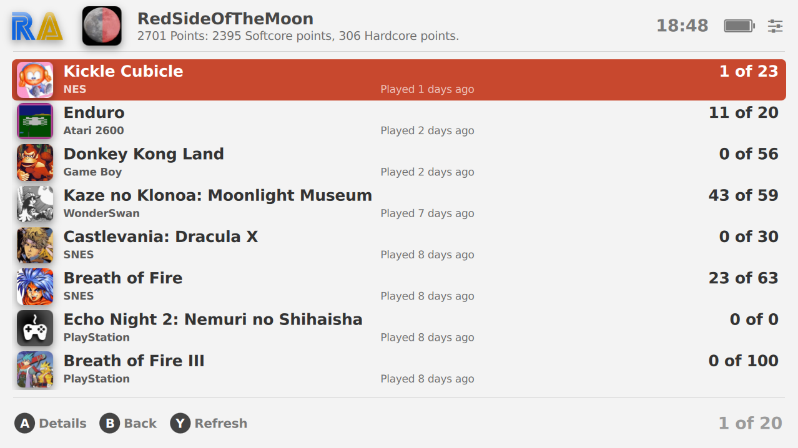

# Sleipnir

Sleipnir, or Retro Mega Sleipnir, is a [Pegasus](https://pegasus-frontend.org) theme for handheld devices.

Adapted from [David Fumberger's RetroMega](https://github.com/djfumberger/retromega) theme. Completely rewritten from scratch by [plaidman](https://github.com/plaidman) as [Retro Mega Next](https://github.com/plaidman/retromega-next) to simplify code and allow to add new features easier. And now modified further by y-muller (RedSideOfTheMoon on Pegasus Discord).

The theme should look good on any device with a wide screen. The main target is the AYN Odin so the theme is named after Odin's eight-legged horse.

I tested it on a device with a 640x480 resolution and it still looked pretty good.

The newest release adds initial support for Retro Achievements. There might still be some rough edges.

---

## Installation and Scraping
[Download](https://github.com/y-muller/retromega-sleipnir) and extract to your [theme directory](http://pegasus-frontend.org/docs/user-guide/installing-themes) under the folder retromega-sleipnir. You can then select the theme in the settings menu of Pegasus.

The theme uses `boxart2dfront` on the games list, `screenshot`, `logo` and `boxFront` in the game detail view, and `video` in both areas.

To setup Pegasus with scraped assets, there's a great written guide [available here](https://basvroegop.nl/pegasus) or a great video guide [available here](https://www.youtube.com/watch?v=fGWve7YYwGQ). You can also use [DragoonDorise's pegasus installer](https://www.pegasus-installer.com/) to scrape files on your device easier.

---

## Features
- optimized for handheld devices with large screens
- RetroAchievements browser
- support for PlayStation buttons
- controller support
- sorting/filtering options
- filter games by name
- touch support
- attract mode (view random game videos)
- random game selection
- background music and navigation sounds
- game details and metadata screen
- settings screen
- dark mode
- multiple image packages for collections

---

## Controls Guide
[CONTROLS.md](CONTROLS.md)

## Settings Guide
[SETTINGS.md](SETTINGS.md)

## Customization Options
[CUSTOMIZATION.md](CUSTOMIZATION.md)

## Version History
[CHANGELOG.md](CHANGELOG.md)

---

## Credits
- more improvements (or making it worse): RedSideOfTheMoon
- original theme and design:
    - [DJFumberger](https://github.com/djfumberger/retromega)
- next improvements:
    - plaidman
- original theme images:
    - [DJFumberger](https://github.com/djfumberger/retromega)
- br1ans theme images:
    - [br1ans](https://www.reddit.com/r/miniSNESmods/comments/av5i33/more_folders_by_request/)
- pixel theme images:
    - [ehettervik](https://github.com/ehettervik/es-theme-pixel)
    - [Jetup13](https://github.com/jetup13/es-theme-pixel)
    - [TheGemsbok](https://github.com/TheGemsbok/es-theme-pixel)
- clusterm theme images:
    - [ClusterM](https://github.com/ClusterM/hakchi2/tree/master/folder_images)
    - [faustbear](https://www.reddit.com/r/miniSNESmods/comments/995ylx/additional_pixel_art_icon_pack_22/)
- a few added images here and there throughout the themes:
    - plaidman

## License

---

---

---

---

